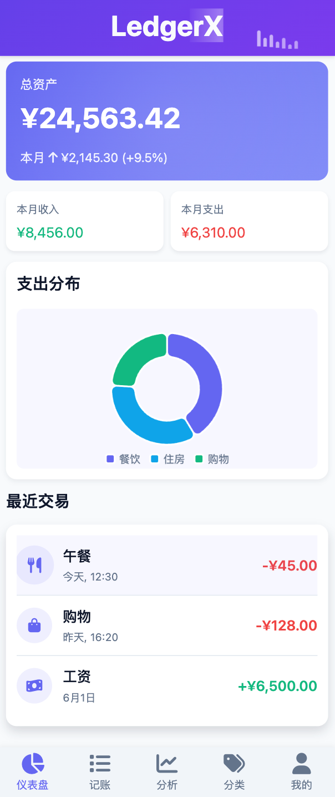
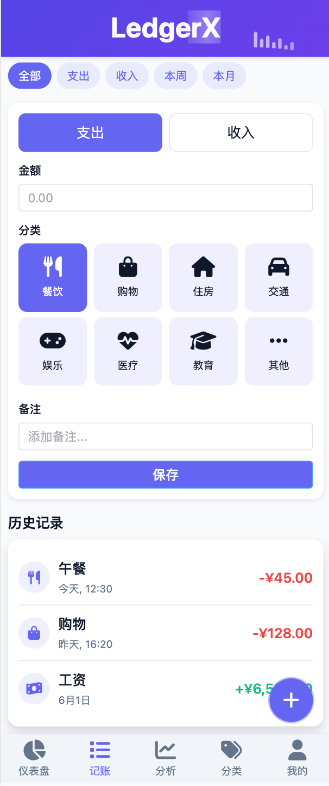
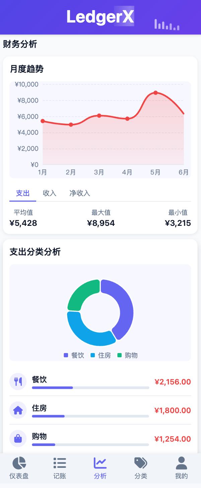
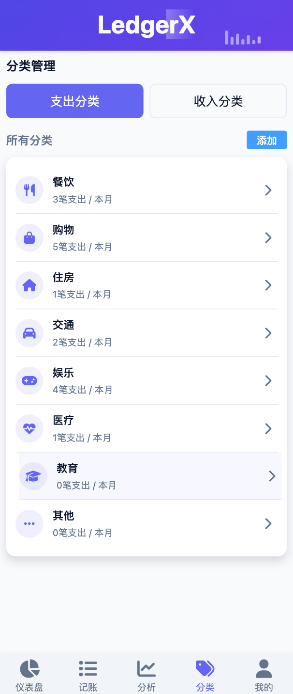
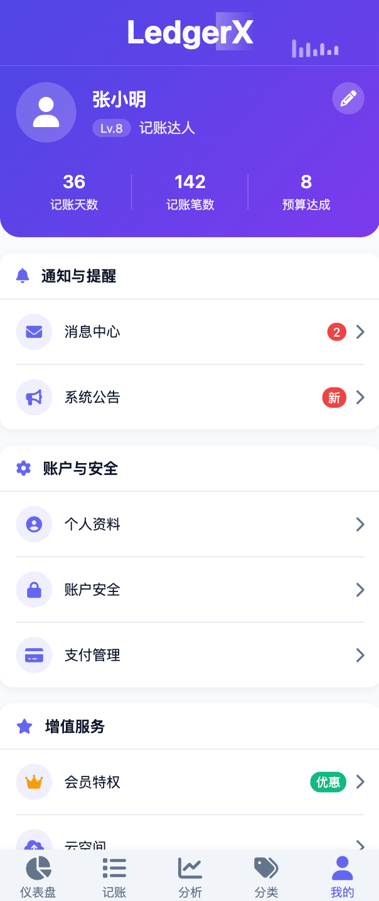

# LedgerX 智能记账软件

LedgerX 是一款基于 Vue 3 + Vite + Element Plus 开发的现代化记账应用，帮助用户轻松管理个人财务。应用采用移动优先设计，同时支持 Web 和移动应用（通过 Capacitor）。

## 项目特点

- 现代化 UI 设计，简洁美观
- 响应式布局，适配多种设备
- 丰富的视觉效果和动画
- 完整的记账和财务分析功能
- 用户友好的交互设计
- 自适应主题色，支持个性化定制
- 支持多端部署（Web、iOS、Android）

## 运行实例

### 仪表盘


### 记账


### 分析


### 分类


### 我的


## 主要功能

### 核心功能

- **财务仪表盘**：总览资产、收支统计、财务趋势
- **记账系统**：快速记录日常支出和收入，支持多账户记账
- **财务分析**：多维度图表分析财务状况，收支趋势、分类占比
- **预算管理**：设置月度/年度预算，自动预算提醒
- **分类管理**：自定义收支分类，灵活配置
- **账单导出**：支持多种格式导出账单数据

### 用户功能

- **用户系统**：账户管理和个性化设置
- **个人资料**：头像、昵称、个人信息管理
- **账户安全**：密码修改、安全设置、登录设备管理
- **消息中心**：系统通知、预算提醒、活动消息
- **系统公告**：查看系统更新和活动通知
- **支付管理**：管理支付方式和查看账单记录

### 增值服务

- **会员特权**：高级功能解锁、无限云存储
- **云空间**：云端数据存储与备份
- **数据恢复**：意外删除数据恢复，历史版本回退
- **使用指南**：详细的功能使用教程
- **意见反馈**：用户问题反馈和建议提交

## 技术栈

- **前端框架**：Vue 3 (Composition API)
- **构建工具**：Vite
- **UI 组件库**：Element Plus
- **状态管理**：Pinia
- **路由管理**：Vue Router
- **图表库**：ECharts
- **图标库**：Font Awesome
- **移动端适配**：Capacitor
- **CSS 预处理器**：SCSS / CSS Variables
- **HTTP 客户端**：Axios

## 安装指南

1. 克隆项目

```bash
git clone https://github.com/qishenonly/LedgerX.git
cd LedgerX
```

2. 安装依赖

```bash
npm install
```

3. 启动开发服务器

```bash
npm run dev
```

4. 构建生产版本

```bash
npm run build
```

5. 构建移动应用（需要先完成 build）

```bash
# 添加 iOS 或 Android 平台
npx cap add ios
npx cap add android

# 同步构建文件到原生项目
npx cap sync

# 打开原生 IDE
npx cap open ios
npx cap open android
```

## 项目结构

```
LedgerX/
├── public/                # 静态资源
├── src/
│   ├── assets/            # 项目资源文件
│   │   ├── images/        # 图片资源
│   │   └── styles/        # 样式文件
│   ├── components/        # 组件
│   │   ├── common/        # 通用组件
│   │   ├── AnnouncementDialog.vue  # 系统公告组件
│   │   ├── CloudSpaceDialog.vue    # 云空间组件
│   │   ├── DataRecoveryDialog.vue  # 数据恢复组件
│   │   ├── FeedbackDialog.vue      # 意见反馈组件
│   │   ├── MembershipDialog.vue    # 会员特权组件
│   │   ├── MessageCenterDialog.vue # 消息中心组件
│   │   ├── PaymentDialog.vue       # 支付管理组件
│   │   ├── ProfileDialog.vue       # 个人资料组件
│   │   ├── SecurityDialog.vue      # 账户安全组件
│   │   ├── UserGuideDialog.vue     # 使用指南组件
│   │   └── ...
│   ├── stores/            # Pinia 状态管理
│   │   ├── user.js        # 用户状态
│   │   ├── transaction.js # 交易记录状态
│   │   ├── budget.js      # 预算状态
│   │   └── ...
│   ├── views/             # 页面视图
│   │   ├── Dashboard.vue  # 仪表盘页面
│   │   ├── Record.vue     # 记账页面
│   │   ├── Analysis.vue   # 分析页面 
│   │   ├── Category.vue   # 分类页面
│   │   ├── UserAccount.vue# 用户账户页面
│   │   └── ...
│   ├── router/            # 路由配置
│   ├── utils/             # 工具函数
│   ├── App.vue            # 主应用组件
│   ├── main.js            # 应用入口
│   └── style.css          # 全局样式
├── android/               # Capacitor Android 平台
├── ios/                   # Capacitor iOS 平台
├── capacitor.config.json  # Capacitor 配置
├── vite.config.js         # Vite 配置
└── ...
```

## 组件说明

### 对话框组件

- **AnnouncementDialog**：系统公告组件，显示系统更新和活动通知
- **MessageCenterDialog**：消息中心组件，管理各类系统消息和提醒
- **ProfileDialog**：个人资料组件，管理用户头像和个人信息
- **SecurityDialog**：账户安全组件，提供密码修改和安全设置
- **PaymentDialog**：支付管理组件，管理支付方式和账单
- **MembershipDialog**：会员特权组件，显示会员功能和订阅选项
- **CloudSpaceDialog**：云空间组件，管理云端存储和备份
- **DataRecoveryDialog**：数据恢复组件，提供数据恢复和历史版本
- **FeedbackDialog**：意见反馈组件，收集用户反馈和建议
- **UserGuideDialog**：使用指南组件，提供功能使用教程

### 视图组件

- **Dashboard**：仪表盘页面，显示财务总览和快捷功能
- **Record**：记账页面，添加和管理收支记录
- **Analysis**：分析页面，提供多维度财务分析图表
- **Category**：分类页面，管理收支分类
- **UserAccount**：用户账户页面，个人信息和设置中心

## 使用说明

### 基本操作

1. **仪表盘**：首页查看资产总览和财务状况
   - 资产卡片：显示总资产、本月收支情况
   - 近期交易：查看最近的收支记录
   - 图表展示：查看收支趋势和分类占比

2. **记账**：点击底部导航栏的"+"按钮添加新的交易记录
   - 选择交易类型：收入/支出
   - 选择分类和子分类
   - 输入金额和备注
   - 选择账户和日期
   - 可添加图片凭证

3. **分析**：查看各类财务图表和预算执行情况
   - 收支趋势：按日/周/月/年查看趋势
   - 分类占比：饼图查看各分类占比
   - 预算执行：预算完成度和剩余情况

4. **分类**：管理收支分类
   - 添加/编辑/删除分类和子分类
   - 调整分类排序和图标

5. **我的**：管理个人账户和设置
   - 个人资料：修改头像、昵称等信息
   - 账户安全：修改密码、安全设置
   - 通知设置：设置各类提醒
   - 高级功能：会员特权、云空间等

### 高级功能

1. **消息中心**：查看和管理系统消息
   - 按类型筛选：全部/系统通知/活动提醒
   - 按状态筛选：已读/未读
   - 标记已读/清空消息

2. **系统公告**：查看官方发布的系统更新和通知
   - 查看详情：了解最新功能和活动
   - 标记已读：管理公告阅读状态

3. **会员特权**：了解和开通会员服务
   - 功能介绍：查看会员专属功能
   - 套餐选择：选择月度或年度会员

4. **云空间**：管理云端数据存储
   - 存储概览：查看存储使用情况
   - 备份管理：设置自动备份和手动备份
   - 文件管理：上传和下载文件

5. **数据恢复**：恢复意外删除的数据
   - 备份历史：查看历史备份记录
   - 已删除项目：恢复最近删除的数据

## 移动应用特性

LedgerX 不仅提供 Web 版本，还通过 Capacitor 支持移动应用：

- **离线使用**：无网络环境下也能使用核心功能
- **生物识别**：支持指纹/面容识别登录
- **本地通知**：预算提醒和账单通知
- **设备同步**：多设备数据同步
- **原生体验**：原生级别的流畅交互和动画

## 最佳实践

- **定期记账**：养成每日记账习惯，保持财务清晰
- **合理预算**：根据收入设置合理预算，控制支出
- **财务分析**：定期查看分析报告，调整消费习惯
- **数据备份**：开启自动备份，防止数据丢失
- **分类管理**：根据个人需求自定义分类，让财务更有条理

## 后续计划

- [ ] 资产负债表功能
- [ ] 家庭共享账本
- [ ] 多货币支持
- [ ] 智能语音记账
- [ ] AI 财务分析与建议
- [ ] 扫描票据自动记账
- [ ] 黑暗模式
- [ ] 自定义主题
- [ ] 账单日历视图
- [ ] 更多图表类型

## 常见问题

**Q: 数据安全性如何保障？**  
A: LedgerX 采用端到端加密，个人财务数据仅存储在本地或加密后存储在云端，确保数据安全。

**Q: 是否支持多设备同步？**  
A: 是的，开通会员后可享受云同步功能，支持多设备无缝切换。

**Q: 如何导出数据？**  
A: 在设置中选择"导出数据"，支持导出为 Excel、CSV 等多种格式。

**Q: 免费版和会员版有什么区别？**  
A: 免费版提供基础记账和分析功能，会员版额外提供云同步、无限云空间、高级分析等功能。

## 贡献指南

我们欢迎社区贡献，提升 LedgerX 的功能和体验：

1. Fork 本仓库
2. 创建您的特性分支 (`git checkout -b feature/amazing-feature`)
3. 提交您的更改 (`git commit -m 'Add some amazing feature'`)
4. 推送到分支 (`git push origin feature/amazing-feature`)
5. 开启一个 Pull Request

## 联系我们

- 官方网站：[www.ledgerx.io](https://www.ledgerx.io)
- 电子邮件：support@ledgerx.io
- GitHub：[https://github.com/qishenonly/LedgerX](https://github.com/qishenonly/LedgerX)

## 许可证

MIT
